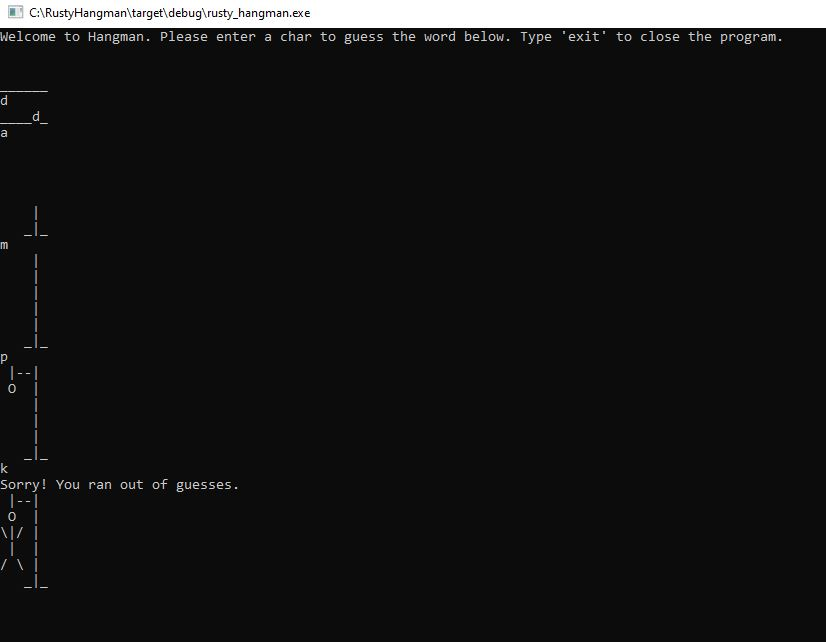

# RustyHangman
This is just my very first project written in Rust! :blush: The idea is based on [this](https://github.com/jesslynlandgren/hangman) repo.

## What is Hangman?
Hangman is a guessing game for one player. The engine thinks of a word and the player tries to guess it. You can do a maximum of 3 failed attempts.

## How does it work?
After running `cargo run` just enter a character and press enter. If a character is not found, you will see parts of Hangman.

## Can I modify the list?
Sure! Just update `words.txt` in root folder.